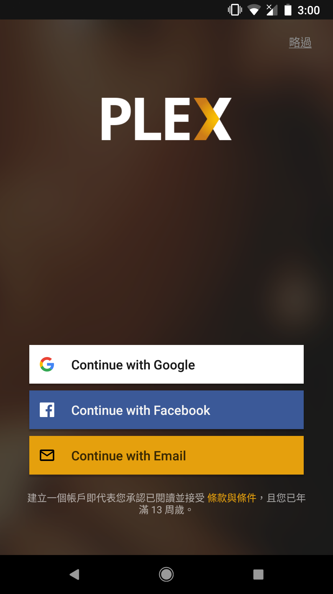
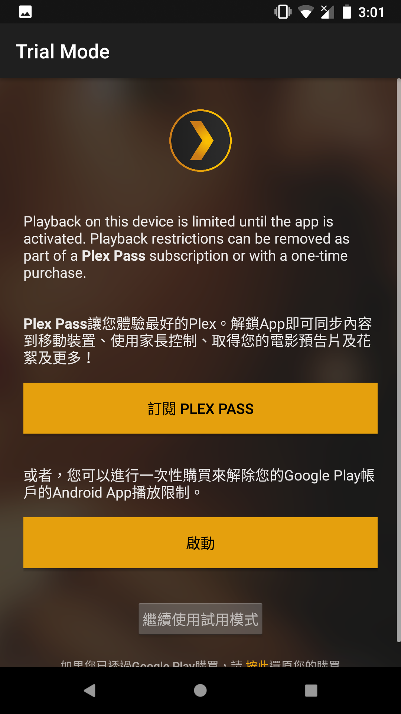
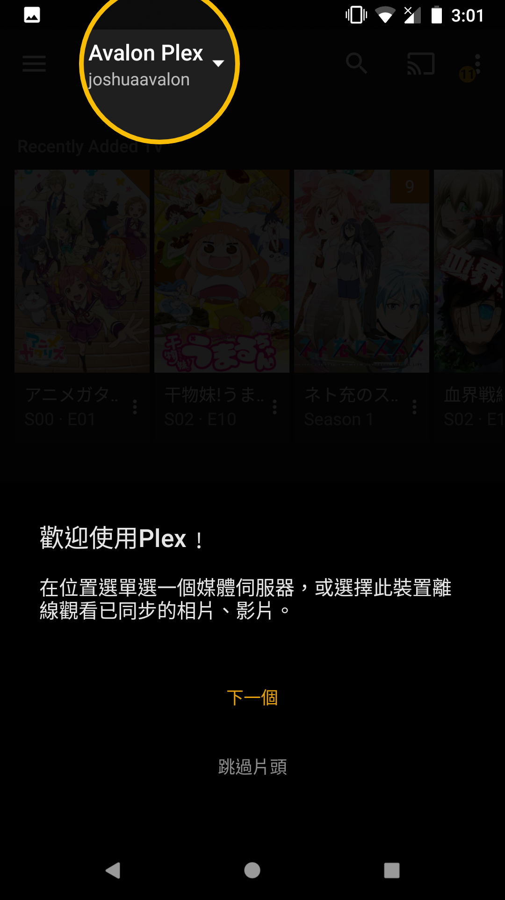
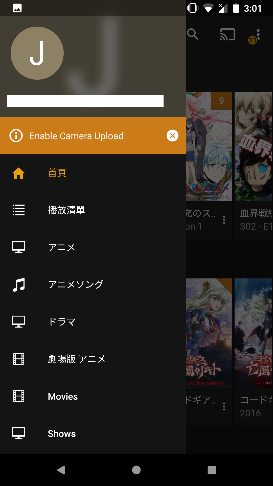
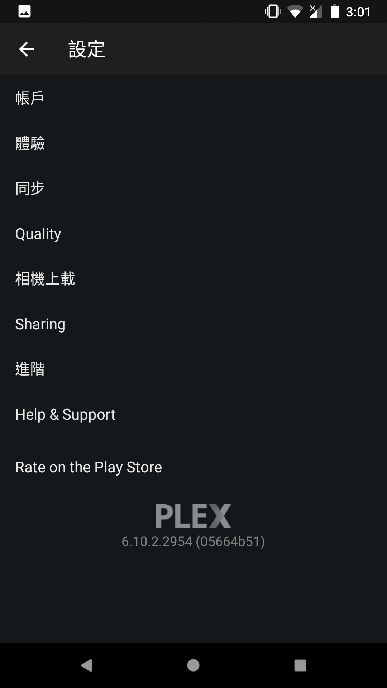
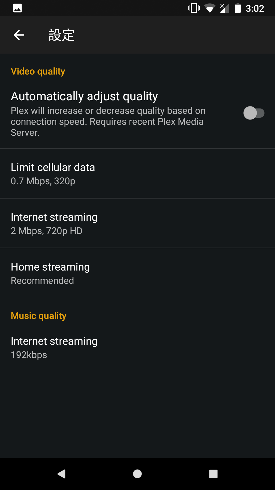
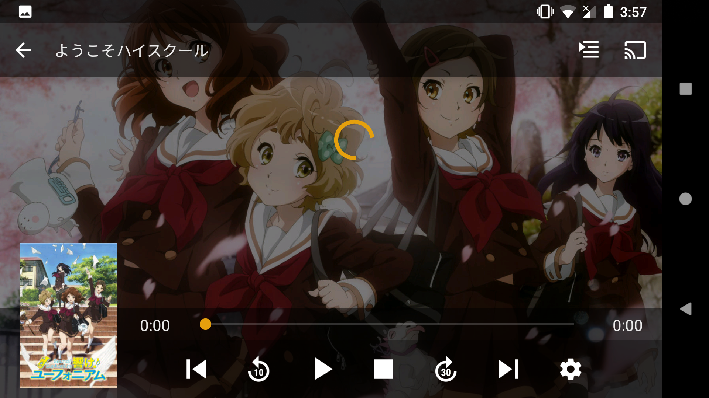
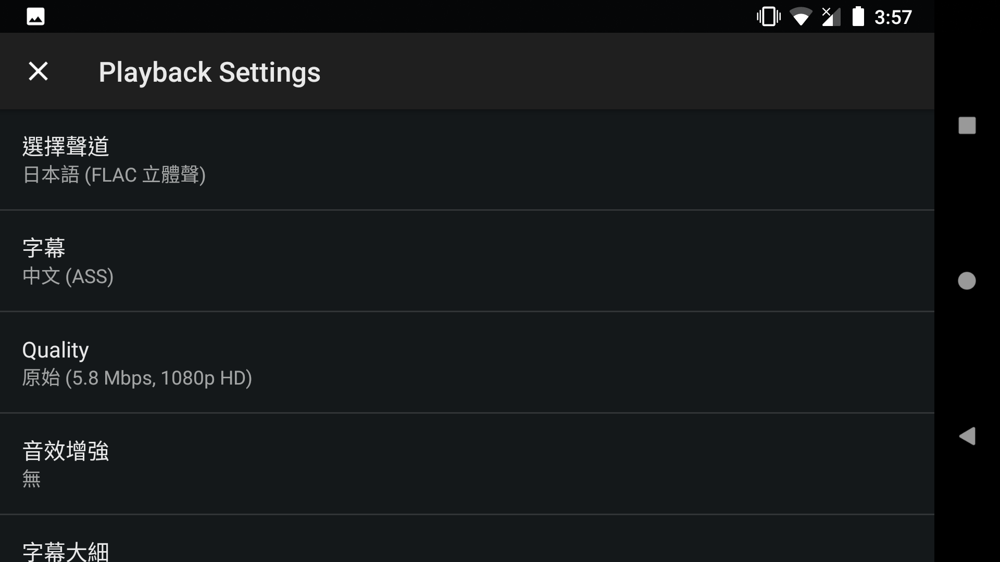
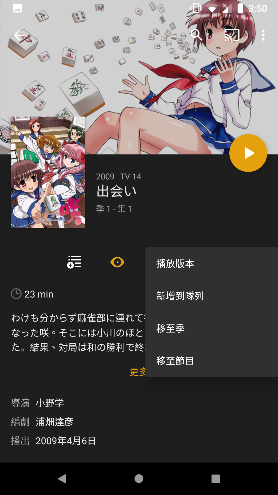

# Android版

!!! tip "提示"
    Android版僅支援Android 4.1+

## 首次設定

* 若你以Google帳戶註冊的話，用`Continue with Google`登入。
* 若你以Facebook帳戶註冊的話，用`Continue with Facebook`登入。
* 若你以電郵註冊的話，用`Continue with Email`登入。

登入後，將會看到以下畫面。

有3個選擇: `訂閱PLEX PASS`, `啟動`, `繼續使用試用模式`

!!! warning "警告"
    你只用客戶端的話，是不需要PLEX PASS。請不要訂閱PLEX PASS。
    
啟動讓你可以在Android上直播Plex上的內容。使用試用模式的話，只能直播不多於5分鐘的內容，但可以先同步(下載)後再觀看。
要注意啟動需要支付5美元，但你所有Android的客戶端都可以使用相同的功能。

你可以觀看教學，或點擊`跳過片頭`跳過。

從左面掃出菜單，你可以關閉`Enable Camera Upload`。本伺服器不支援此功能。
在菜單下方選擇`設定`。

選擇`Quality`。

於`Internet Streaming (Video Quality)`選擇`Maximum`及`Internet Streaming (Music Quality)`選擇`原始`。

## 常見問題

!!! question "如何選擇聲道或字幕?"
    在播放中，按<i class="md-icon">&#xE8B8;</i>選擇聲道或字幕。

!!! question "如何選擇版本?"
    部份內容有不同的版本: TV、BD等，你可以打開菜單選擇。

