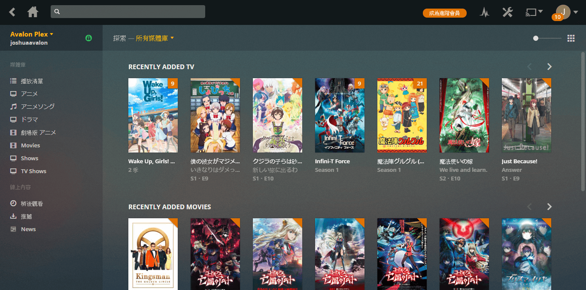

# 簡介

歡迎來到《Plex 使用者指南》。本指南將引導你設置你的客戶端(不含伺服器)。

!!! tip "提示"
    若你已經有Plex的帳戶並了解Plex是甚麼，請從左方選擇你的客戶端。
    如果你是首次使用該客戶端

## Plex是甚麼

Plex是由用使用者自行架設的多媒體分享伺服器，簡單而言，就是自己的Netflix。使用者可以從電腦、手機及電視隨時隨地看到伺服器的內容，
而不用將影片先複製到裝置之上。若你的裝置不能播放某格式的影片的話，Plex伺服器也會幫你轉到合適的格式。

## 如何註冊Plex帳戶

目前有兩種方法註冊，分別為用家邀請及自行註冊。

若被其他用家邀請的話，你將收到一封電郵。點擊`I accept the invitation`。

若是自行註冊的話，前往[https://www.plex.tv/sign-up/](https://www.plex.tv/sign-up/)。

兩都都會看到以下畫面。

### 使用電郵帳戶註冊

點擊`CONTINUE WITH EMAIL`

點擊`sign up with email`

於`EMAIL ADDRESS`輸入你希望使用的電郵地址。於`CREATE PASSWORD`輸入不少於八個字的密碼。點擊`CREATE AN ACCOUNT`註冊。

### 使用Google帳戶註冊

點擊`CONTINUE WITH GOOGLE`，並按照新開視窗的指示，允許Plex使用你的Google帳戶作登入。

### 使用Facebook帳戶註冊

點擊`CONTINUE WITH FACEBOOK`，並按照新開視窗的指示，允許Plex使用你的Google帳戶作登入。

### 註冊成功

註冊成功後，你將看到以下畫面。

!!! tip "提示"
    若你被其他用家邀請的話，你將看到他分享給你的Plex。否則只是空白一片。
    
請選擇你的客戶端繼續: [網頁版](web.md)、[Android版](android.md)、[iOS版](ios.md)。

## 常見問題

!!! question "封面右上角的橙色是甚麼?"
    右上角的橙色代表你未觀看。若中間有數字的話，代表有多少集未觀看。

!!! question "為甚麼沒有字幕?"
    少部份內容是沒有字幕。
