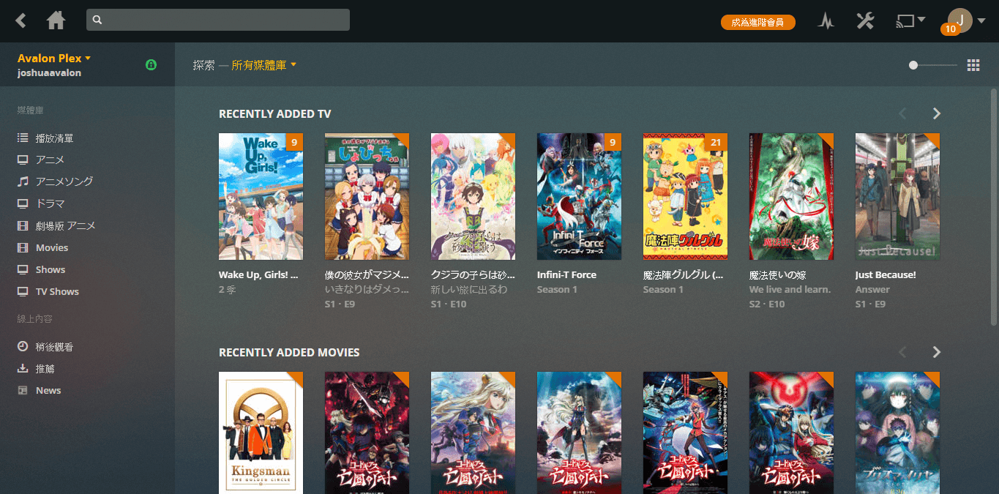
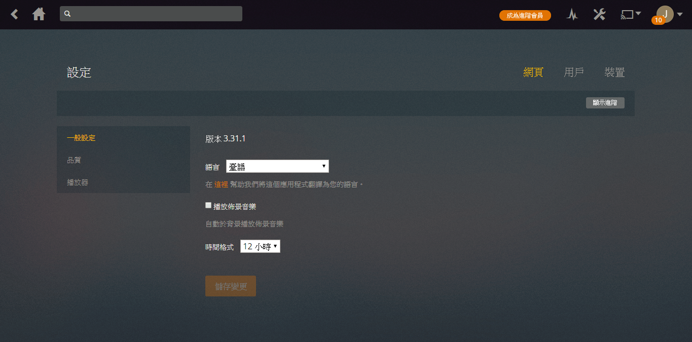
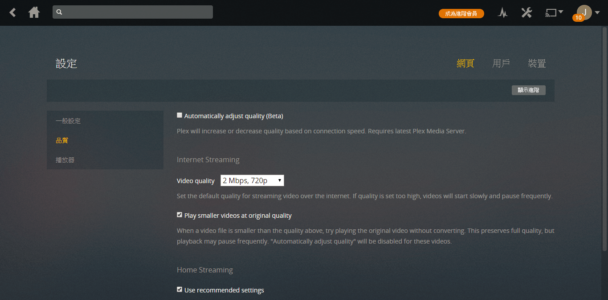
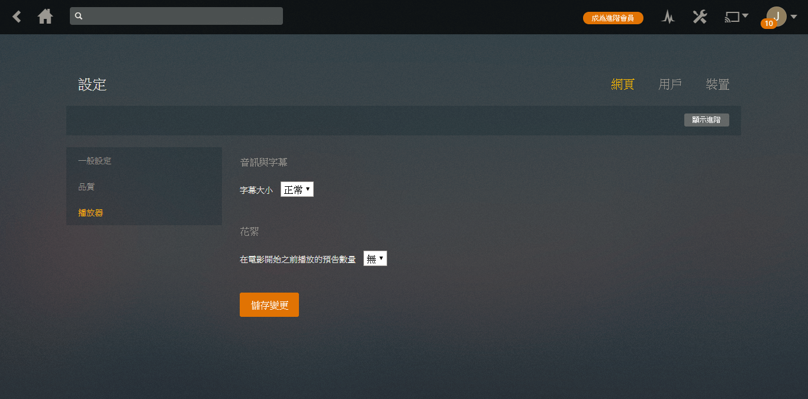

# 網頁版

!!! tip "提示"
    網頁版僅支援以下瀏覽器:
    
    * Chrome
    * Edge
    * Firefox
    * Internet Explorer 11或以上
    * Safari
    
    若遇上任何問題，請先嘗試更新你的瀏覽器。

前往[https://app.plex.tv/](https://app.plex.tv/)或伺服器的地址(請問伺服器擁有人)。
請確定左上是`Avalon Plex`。若不是的話請選回，指定的伺服器。

!!! warning "警告"
    請不要在手機上使用網頁版。網頁版是為電腦而設。手機請用專屬的應用程式。

## 首次設定

點擊右上角的設定
。

請確定右上已選網頁。左面選擇`播放器`，然後在`Video quality`選擇`Maximum`。最後按下方的`儲存變更`。

其他設定請參考下方的設定解說。

## 設定
以下將會詳細解說每項設定。

!!! tip "提示"
    你必須按`儲存變更`設定才會生效。

### 一般設定

點擊右上的`網頁`後，點擊左面`一般設定`。

#### 版本

此為當前網頁版的版本，並非伺服器的版本。

#### 語言

選擇介面顯示語言，並非影片的語言。建議選擇臺語或English。

#### 播放佈景音樂

本伺服器**不支援**佈景音樂。勾選後也不會生效。

#### 時間格式

選時間的顯示格式:12小時制或24小時制。

### 品質

點擊右上的`網頁`後，點擊左面`品質`。

#### Automatically adjust quality (Beta)

讓Plex自動調節品質。因為功能未完善**不建議勾選**

#### Video quality

選擇預設播放品質。請選Maximum(最高)。

#### Play smaller videos at original quality

請勾選。 勾選此選項即使未夠位元速率時，也會以原畫質播放。

#### Use recommended settings

請勾選。此選項等同在Lan時選擇最高品質。但理論上你不會在伺服器的Lan上，所以不會有分別。

### 播放器

點擊右上的`網頁`後，點擊左面`播放器`。

#### 字幕大小

此選項僅對外掛字幕有效。(你可以選擇字幕的影片)

#### 花絮

在播放電影前，播放其他你未看過在同一媒體庫的花絮。

## 進階設定

!!! warning "警告"
    一般情況下你不需要更改進階設定。請在修改前知道你在修改甚麼

點擊右上的`網頁`後，點擊左面`一般設定`。點擊右上`顯示進階`。

### 一般設定

#### 當作播放器

當你時用其他客戶端時，可以將內容傳輸到此播放。

#### 允許後援至不安全連線

允許非SSL連線。**建議永不**

### 除錯

#### 除錯層級
開啟Debug log。

#### 直接播放
**建議勾選**。不勾選的話，將不必要加重伺服器負荷。

#### 直接串流
**建議勾選**。不勾選的話，將不必要加重伺服器負荷。

### 播放器

#### 多聲道音量增加

請按喜好選擇。

#### 燒錄字幕

選擇自動的話，目前僅srt字幕會不燒錄字幕。不燒錄字的話，在視窗比例不合影片時，字幕會出現於影片以外的地方。